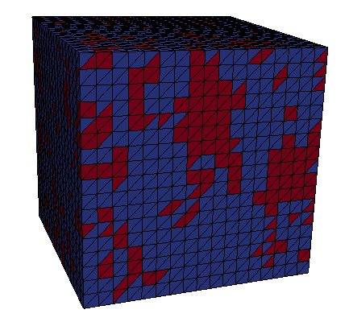
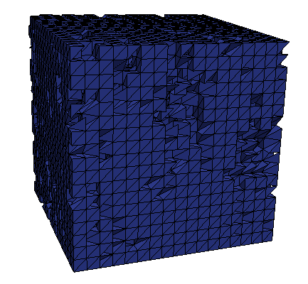
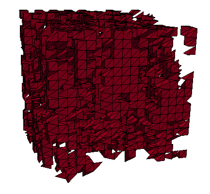
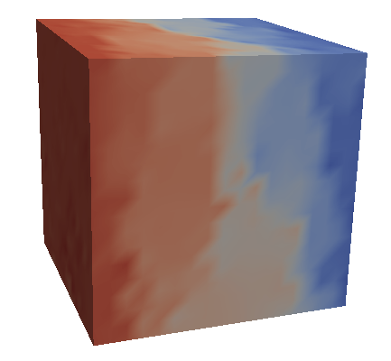

# FlowSolver3D
### About
* FlowSolver3D is a simulator that solves velocity and pressure fields equations of 3D binary images using the Finite Element Method.
Currently the fluid flow can be describe using Brinkman equation <a href="https://en.wikipedia.org/wiki/Darcy%27s_law#Brinkman_form_of_Darcy's_law">[1]</a>.

### How to install the dependencies
#### Globally
* Make sure that you have python3 installed in your computer
* Install the required packages in requirements.txt with the following command `pip3 install -r requirements.txt`
* Install the FeniCS plataform <a href="https://fenicsproject.org/download/">[3]</a>.

#### Docker

### Libraries Use
* FEniCS - The Fenics plataform is a open-source project for solving partial differential equations. The simulator made available in this page uses the Fenics plataform to generate the structured mesh and also to solve the discretized problem within the Finite
Element Method.
* scikit-image - Used to manipulate the input binary images.

### Methodology
* Following the proposed implemented methodology of Brinkman model using the Finite Element Method, the binary image is meshed with two subdomains, a pressure driven flow is set by imposing a Neumann boundary condition on two boundary faces of the cuboid domain (inlet pressure and outlet pressure), a slip boundary condition is set by a Dirichlet boundary condition on the four other boundary faces of the cuboid domain. The fluid viscosity and the porous matrix permeability are set to an arbitrary value.

### Screenshots
* The images presented bellow were generate using Paraview.

#### Meshes and Subdomains

  
  
  

 

## Velocity and pressure fields

  
   
   

 